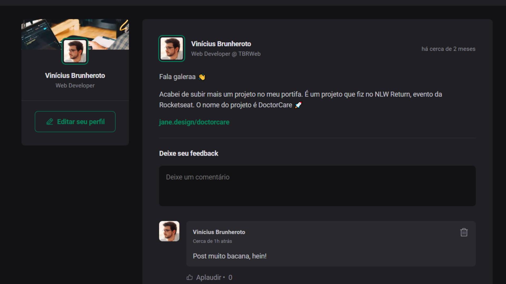

<h1 align="center"> Projeto 1- Iniciando com React.js </h1>

 Ignite Feed - Parte do <strong>JavaScript</strong>

  <a href="#-tecnologias">Tecnologias</a>&nbsp;&nbsp;&nbsp;|&nbsp;&nbsp;&nbsp;
  <a href="#-projeto">Projeto</a>&nbsp;&nbsp;&nbsp;|&nbsp;&nbsp;&nbsp;
  <a href="#-layout">Layout</a>&nbsp;&nbsp;&nbsp;|&nbsp;&nbsp;&nbsp;

 

  </a>

## 🚀 Tecnologias

Esse projeto foi desenvolvido com as seguintes tecnologias:

- HTML e CSS
- React + JavaScript
- Git e Github
- Vite

## 💻 Projeto

Nesse módulo, foi criado uma aplicação React utilizando o Vite e aprendido sobre os conceitos mais importantes do React, entre eles estão componentização, propriedades, estados, imutabilidade e hooks.

## 🔖 Layout

Você pode visualizar o layout do projeto através [DESSE LINK](https://www.figma.com/community/file/1113573231685349036/ignite-feed). É necessário ter conta no [Figma](https://figma.com) para acessá-lo.

---

Feito por Vinícius Brunheroto :wave: (https://viniciusbrunheroto.github.io/linktree-pessoal/)
